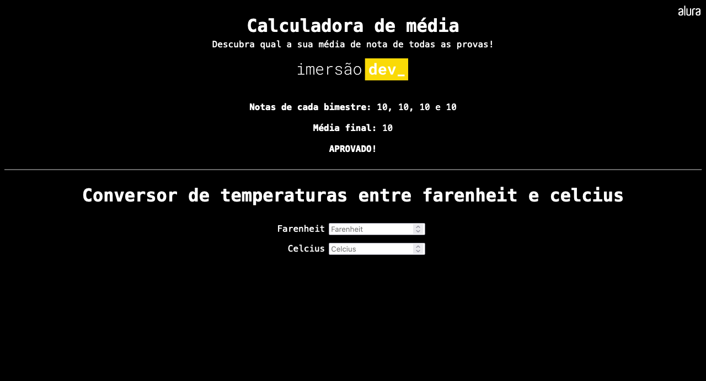

# Calculadora de média e conversor de temperaturas (Variáveis, operações e média)

### Screenshot

https://imersao.dev/aulas/aula01-variaveis-operacoes-media

### Conteúdo detalhado desta aula:

- Criar uma conta no CodePen;
- Entender as diferenças entre HTML, CSS e JavaScript;
- Variáveis, manipulação dos valores armazenados e a memória do computador;
- Tipos de variáveis, como texto e inteiro;
- Fixando a quantidade de casas decimais com a função toFixed().

### Desafios desta aula!

- [x] Dependendo da nota, mostrar se a aluna ou aluno foi aprovada(o) ou não;
- [x] Alterar o fundo da tela da maneira que achar mais legal;
- [x] Imprimir na própria página o resultado, ao invés do console;
- [x] Criar um conversor de temperaturas entre farenheit e celcius;
- [x] Colocar a conta inteira da média em apenas uma linha.

A [Pen](https://codepen.io/rhatiro/pen/xxjwgoK) by [rhatiro](https://codepen.io/rhatiro) on [CodePen](https://codepen.io).

[License](https://codepen.io/license/pen/xxjwgoK).
